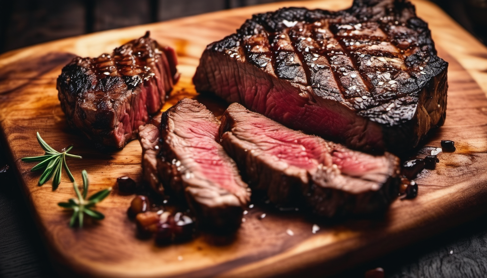

<h1 align="center">Charred Chops</h1>

[View live deployment here!](https://jomazzei-charred-chops-161a869d9d8b.herokuapp.com/)

This website project is for a hypothetical steakhouse, Charred Chops, with the main goal of offering a user friendly manner to book and manage a reservation with the restaurant.

In future the features of the application will scale beyond just user reservation, also offering the staff a way to manage the displayed menu and manage all customer bookings

 

#### Table of Contents:

* [Agile and Tech Stack Overview](#agile-and-tech-stack-overview)
  * [Ideation and Agile](#ideation-and-agile)
  * [Tech Stack](#tech-stack)
* [Wireframes and Database Schema](#wireframes-and-database-schema)
  * [Home page](#home-page)
  * [Booking page](#booking-page)
  * [Database diagram](#database-diagram)
  * [Changes to the Reservation Model](#changes-to-the-reservation-model)
* [User Stories and Features](#user-stories-and-features)
  * [Full Layout of Milestones](#full-layout-of-milestones)
  * [Core Focus](#core-focus)
  * [Future focus](#future-focus)
* [Testing](#testing)
* [Credits](#credits)

   

## Agile and Tech Stack Overview
[back to content table](#table-of-contents)

 

#### Ideation and Agile

 During the ideation process for choosing a project I referred to the briefs on the CI LMS. I ended up choosing the restaurant booking system as the outline for my project.
 I did some quick brainstorming for names and wrote out baseline user stories, whether those be current or future iterations, that informed the core features of the website. 

 Throughout development I would add more user stories to my project board that would expand the website's functionality and enrich it's value, while ensuring I maintained a focussed scope and goal for this deadline 
 I split certain features into easier to track issues or task checklists depending on whether they were explicitly part of a user story or not. 
 Certain design aspects would fit into that category, such as error pages. They could have been rephrased and reworked into more stories but I felt it would take away from the main focus
 of agile, which is to inform scope and promote efficiency throughout an iteration through breaking down tasks.

 

#### Tech Stack

 The following high level technologies and frameworks were used to deliver the project in it's current state:

- VS Code
- GitHub
- Lucidchart
- HTML5 & CSS3
- Bootstrap 5
- JavaScript
- Python 3.12
- Django 4.2

 For a detailed list of package usage and requirements, please see the requirements.txt.

 

## Wireframes and Database schema
[back to content table](#table-of-contents)

 

### Home Page

 

### Booking Page

 

### Database Diagram

#### Changes to the Reservation Model

 I drew out the model quite broadly initially, more fitting to a larger scope and longer iteration. 
 During the prioritization I narrowed down the model quite a bit to focus more on the key feature of booking a reservation. 
 This is the current working version of the model in diagram form:

 

 

## User Stories and Features
[back to content table](#table-of-contents)
 
 

### Full Layout of Milestones

- __Reservation__
  - USER STORY: Book a table:
    - As a user I want to book a table so that I can secure a reservation.
  - USER STORY: View own bookings:
    - As a user I can access my own bookings so that I can edit their details, cancel them, or just view them.
  - USER STORY: Edit reservation details:
    - As a user I want to be able to change specifics about my reservation so that I can reschedule or tweak the guest count to suit my needs.
  - USER STORY: Cancel booking:
    - As a user I want to be able to cancel a booking so that I can change the schedule of my plans / let the restaurant know I won't be showing up.
  - USER STORY: E-mail booking confirmation:
    - As a user I want to receive email notifications for booking confirmations so that I have extra peace of mind that my booking is successful, as external confirmation is the current norm.  
  - FEATURE/TASK: Reservation model:
    - Create model that will contain and save the data in relevant fields for a restaurant booking.

- __User Auth__
  - USER STORY: Account creation / login:
    - As a user I want to be able to sign up for an account/log in to my account so that I can book or manage reservation.
  - USER STORY: Account management:
    - As a user I want to be able to view my account details so that I can confirm and edit my details, or delete my account.
  - 403 Pages:
    - All pages that require authentication need a 403 Error if unauthorized access is detected.

- __Design__
  - USER STORY: Contact and location info:
    - As a user I want to be able to see the restaurants contact info and location so that I can call them if needed, or see where the restaurant is.

 

### Core Focus
The focus so far has been to deliver a robust booking system and easy to use interface, as well as lay strong foundations for future implementations.  

 

### Future Focus
The main features left to implement are currently:

For a full overview of all tasks, prioritization and backlog, please look at the [project board](https://github.com/users/jomazzei/projects/4/views/1).

 

## Testing 
[back to content table](#table-of-contents)

 

This project is currently undergoing the following validations and performance tests, and are updated according to progress.
### Validation
- __HTML__
  - [The W3C Markup Validator](https://validator.w3.org/#validate_by_input)
    - All HTML has passed full validation except for 1 page, Sign Up. Validator error is missing paragraph tags within it's scope, though they appear where expected. Presumably a problem with the default AllAuth forms and they will be changed in an upcoming update to a custom sign in model that takes e-mails as the primary username field.
- __CSS__
  - [The W3C CSS Validator](https://jigsaw.w3.org/css-validator/)
    - CSS has passed full validation except for 1 line, "shape-outside". It's a seemingly often unsupported style across some browsers and will be changed to a suitable alternative/removed in future.
- __Python Linter__
  - [CI Python Linter](https://pep8ci.herokuapp.com/)

 

### Performance & Contrast Tests
- __Performance__
  - [Lighthouse](https://developer.chrome.com/docs/lighthouse/overview)
- __Contrast__
  - [WCAG](https://chromewebstore.google.com/detail/plnahcmalebffmaghcpcmpaciebdhgdf)

 

### Debugging & Test Module
-__Some of the key bugs will be listed here and how they were dealt with__
  - Currently the full view of all tracked and fixed bugs can be found on the [project board](https://github.com/users/jomazzei/projects/3/views/1)

 

# Credits
[back to content table](#table-of-contents)
 
 

### Images

- Created logo on Krita.

 

- Hero steak image on home page generated by [Pixlr AI generator](https://pixlr.com/image-generator/)

 

- Chef image in who we are section generated by [Pixlr AI generator](https://pixlr.com/image-generator/)

 

##### _Disclaimer_
  _
Images generated by AI has the posibility to be based on online creators' works
_
  _
For the use of the included images, AI training content is presumed to have been fairly compensated
_

 

### Content and Code
- Design inspirationas from [Miller & Carter steakhouse](https://www.millerandcarter.co.uk/).
- Baseline HTML template for AllAuth taken from [Django blog walkthrough project](https://github.com/jomazzei/django-blog), originally created by [Code Institute](https://codeinstitute.net/?_gl=1*xh7bh0*_up*MQ..&gclid=CjwKCAjwkuqvBhAQEiwA65XxQA_KVRG0RaWOXmBe9aqfp9kJ_Vw14KkL0WQhpPMGA4STT5MNmkBC2hoC-aUQAvD_BwE).
- Baseline code for similar functions, such as List view and Form submission view adapted from [Django blog walkthrough project](https://github.com/jomazzei/django-blog), originally created by [Code Institute](https://codeinstitute.net/?_gl=1*xh7bh0*_up*MQ..&gclid=CjwKCAjwkuqvBhAQEiwA65XxQA_KVRG0RaWOXmBe9aqfp9kJ_Vw14KkL0WQhpPMGA4STT5MNmkBC2hoC-aUQAvD_BwE).
- ReadMe structure templated from the hackathon project [Campus Connect](https://github.com/jomazzei/campus-connect), from which the ReadMe was originally based off of hackathon project [Belgian Bakes](https://github.com/Tariq-845/belgian-bakes).
- Referred to various sources (not all inclusive) for fixes and implementations for features I wasn't knowledgeable on:
  - Django docs
  - Bootstrap docs
  - Stackoverflow
  - ChatGPT
  - YouTube
  - W3 Schools
  - Geeks for Geeks

 

#### Note on the use of ChatGPT for coding related queries:
I ensured that I used ChatGPT only as an assisting tool throughout this project.
Most use-cases were not finding the right answers on stackoverflow to aid in writing out my functions or needing a more specific question answered.
These answers were often items in the Django docs or other tools and packages that I didn't know existed - such as built-in parameters like "context_object_name" and "validators", or "datetime" and "string" modules.

In more specific code block cases, my questions centered around debugging and making sure I was on the right track for the sake of time.
One such instance is writing a for loop for every form error from the view rather than the template, and displaying them in a single toast message. I couldn't get it to work within a single toast message and went back to iterating from the template
